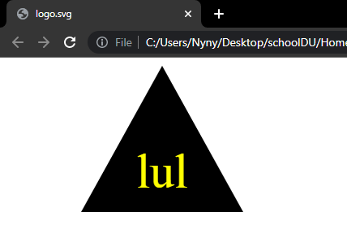

# SVG Logo Maker

## Description

With a few inputs we will create a custom logo saved as an svg file.

## Table of Contents

- [Installation](#installation)
- [Usage](#usage)
- [License](#license)
- [Collaborators](#collaborators)
- [Contributing](#contributing)
- [Tests](#tests)
- [Questions](#questions)

## Installation

No install necessary!

## Usage

This application is designed to quickly create logos of different shapes, colors, and with different texts.

## License

## Collaborators

None yet.

## Contributing

If you'd like to contribute to this project contact me below.

## Tests

To create a new logo, navigate to /SVGLogoMaker in the terminal and type "node index.js". Then follow the prompts.

To run a test, navigate to /SVGLogoMaker in the terminal and type "npm run test"

## Questions

If you have any questions don't hesitate to contact me:

Github: https://github.com/PaulGibes

Email: paulgibes@gmail.com
